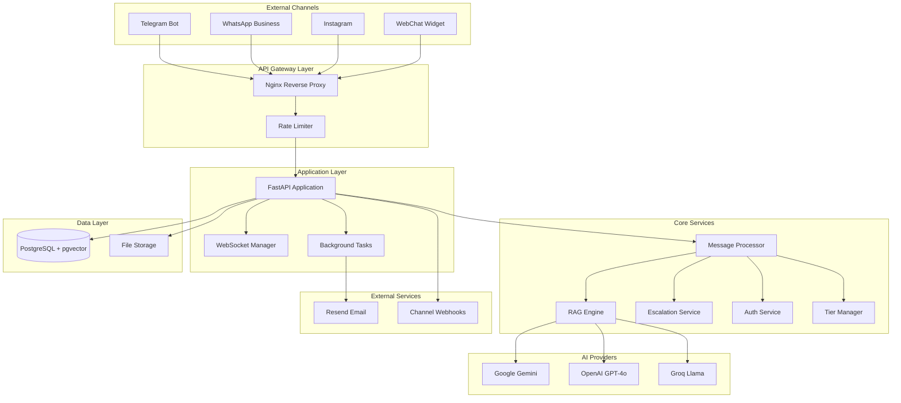

# Design Document

## Overview

The ChatSaaS Backend is a comprehensive FastAPI-based customer support platform that enables businesses to manage multi-channel customer conversations with AI-powered responses and human agent escalation. The system provides a complete SaaS solution with multi-tenant architecture, real-time communication, and pluggable AI provider integration.

### Core Architecture Principles

- **Multi-tenant isolation**: Each workspace operates independently with strict data separation
- **Pluggable AI providers**: Support for Google, OpenAI, and Groq with consistent interfaces
- **Event-driven processing**: Webhook-based message ingestion with background processing
- **Real-time communication**: WebSocket-based notifications for agents and administrators
- **Security-first design**: Comprehensive authentication, encryption, and rate limiting
- **Scalable document processing**: Vector-based RAG system with efficient similarity search

### System Boundaries

The system handles:
- Multi-channel message ingestion (Telegram, WhatsApp, Instagram, WebChat)
- AI-powered response generation with document-based knowledge retrieval
- Human agent escalation and real-time notifications
- Multi-tier subscription management with usage enforcement
- Platform administration and analytics
- Public API for website chat widgets

The system does not handle:
- Direct channel UI (relies on existing platforms like Telegram, WhatsApp)
- Payment processing (tier management is manual)
- Advanced analytics or reporting beyond basic metrics
- File storage beyond local filesystem

## Architecture

### High-Level System Architecture



### Service Architecture

The application follows a layered service architecture:

1. **API Layer**: FastAPI endpoints handling HTTP requests and WebSocket connections
2. **Service Layer**: Business logic services for message processing, authentication, and management
3. **Provider Layer**: Abstracted interfaces for AI providers and external services
4. **Data Layer**: Database models and file storage management

### Multi-Tenant Architecture

Each workspace operates as an isolated tenant with:
- Separate data partitioning by workspace_id
- Independent channel configurations and credentials
- Isolated document storage and processing
- Separate usage tracking and tier enforcement
- Independent agent management and notifications

## Components and Interfaces

### Core Components

#### Message Processor
**Purpose**: Central orchestrator for incoming customer messages
**Responsibilities**:
- Maintenance mode checking
- Message deduplication using external_message_id
- Token limit validation before AI processing
- Coordination with RAG Engine and Escalation Service
- Usage tracking and limit enforcement

**Interface**:
```python
from uuid import UUID

class MessageProcessor:
    async def process_message(
        self, 
        workspace_id: UUID,
        channel_id: UUID,
        contact_id: UUID,
        message_content: str,
        external_message_id: str
    ) -> ProcessingResult
```

#### RAG Engine
**Purpose**: Document-based knowledge retrieval and AI response generation
**Responsibilities**:
- Query embedding generation
- Vector similarity search with 0.75 threshold
- Contextual response generation using conversation history
- Fallback message handling when no relevant content found

**Interface**:
```python
from uuid import UUID

class RAGEngine:
    async def generate_response(
        self,
        query: str,
        workspace_id: UUID,
        conversation_history: List[Message],
        max_chunks: int = 5
    ) -> RAGResponse
    
    async def search_documents(
        self,
        query_embedding: List[float],
        workspace_id: UUID,
        threshold: float = 0.75
    ) -> List[DocumentChunk]
```

#### Escalation Service
**Purpose**: Intelligent escalation detection and agent notification
**Responsibilities**:
- LLM-based escalation classification with confidence scoring
- Keyword-based explicit escalation detection
- Frustration and urgency pattern recognition
- Agent notification via WebSocket or email

**Interface**:
```python
from uuid import UUID

class EscalationService:
    async def should_escalate(
        self,
        message: str,
        conversation_history: List[Message]
    ) -> EscalationDecision
    
    async def escalate_conversation(
        self,
        conversation_id: UUID,
        reason: EscalationType,
        confidence: float
    ) -> None
```

#### AI Provider Abstraction
**Purpose**: Unified interface for multiple AI providers
**Responsibilities**:
- LLM response generation (Google Gemini, OpenAI GPT-4o-mini, Groq Llama)
- Embedding generation (Google gemini-embedding-001, OpenAI text-embedding-3-small)
- Provider-specific message format conversion
- Consistent error handling across providers

**Interface**:
```python
class AIProvider(ABC):
    @abstractmethod
    async def generate_response(
        self,
        messages: List[ChatMessage],
        system_prompt: str
    ) -> AIResponse
    
    @abstractmethod
    async def generate_embedding(
        self,
        text: str
    ) -> List[float]
    
    @abstractmethod
    async def classify_escalation(
        self,
        message: str,
        context: str
    ) -> ClassificationResult
```

#### WebSocket Manager
**Purpose**: Real-time communication for agents and administrators
**Responsibilities**:
- JWT-authenticated WebSocket connections
- Workspace-isolated connection pools
- Event broadcasting for escalations, claims, and messages
- Automatic connection cleanup

**Interface**:
```python
from uuid import UUID

class WebSocketManager:
    async def connect(
        self,
        websocket: WebSocket,
        workspace_id: UUID,
        user_id: UUID
    ) -> None
    
    async def broadcast_to_workspace(
        self,
        workspace_id: UUID,
        event: WebSocketEvent
    ) -> None
```

#### Tier Manager
**Purpose**: Subscription tier enforcement and usage tracking
**Responsibilities**:
- Channel, agent, document, and message limit enforcement
- Monthly usage counter management
- Tier-based feature access control
- Usage reset on monthly boundaries

**Interface**:
```python
from uuid import UUID

class TierManager:
    async def check_channel_limit(
        self,
        workspace_id: UUID
    ) -> bool
    
    async def check_message_limit(
        self,
        workspace_id: UUID,
        token_count: int
    ) -> bool
    
    async def increment_usage(
        self,
        workspace_id: UUID,
        tokens_used: int
    ) -> None
```

### External Integrations

#### Channel Webhooks
- **Telegram**: X-Telegram-Bot-Api-Secret-Token verification
- **WhatsApp/Instagram**: HMAC-SHA256 signature verification with app secret
- **WebChat**: Public API with rate limiting and session management

#### Email Service (Resend)
- Agent invitation emails with secure tokens
- Escalation alerts to workspace owners
- Configurable sender address and branding

#### Security Components
- **JWT Authentication**: 7-day token validity with role and workspace claims
- **Webhook Verification**: Timing-safe signature comparison
- **Encryption**: AES-256-CBC for channel credentials
- **Rate Limiting**: Database-backed counters for WebChat sessions

#### WebChat Config API
**Purpose**: Public API for website chat widget configuration
**Responsibilities**:
- Widget configuration retrieval by workspace slug
- Public endpoint validation and error handling
- Widget display settings and branding information
- Session management for WebChat interactions

**Interface**:
```python
from uuid import UUID

class WebChatConfigAPI:
    async def get_widget_config(
        self,
        workspace_slug: str
    ) -> WidgetConfig
    
    async def validate_widget_session(
        self,
        widget_id: UUID,
        session_token: str
    ) -> bool
```

## Data Models

### Core Entities

#### User and Workspace
```python
from uuid import UUID

class User(BaseModel):
    id: UUID
    email: str
    password_hash: str  # bcrypt
    role: UserRole  # owner, agent
    workspace_id: UUID
    is_active: bool
    created_at: datetime

class Workspace(BaseModel):
    id: UUID
    business_name: str
    slug: str  # unique, URL-friendly
    tier: TierType  # free, starter, growth, pro
    owner_id: UUID
    fallback_message: str
    is_active: bool
    created_at: datetime
```

#### Channel and Contact Management
```python
from uuid import UUID

class Channel(BaseModel):
    id: UUID
    workspace_id: UUID
    type: ChannelType  # telegram, whatsapp, instagram, webchat
    name: str
    credentials: str  # encrypted JSON
    is_active: bool
    created_at: datetime

class Contact(BaseModel):
    id: UUID
    workspace_id: UUID
    channel_id: UUID
    external_id: str  # platform-specific user ID
    name: str
    metadata: dict  # platform-specific data
    created_at: datetime
    
    class Meta:
        unique_together = [("workspace_id", "channel_id", "external_id")]
```

#### Conversation and Message Flow
```python
from uuid import UUID

class Conversation(BaseModel):
    id: UUID
    workspace_id: UUID
    contact_id: UUID
    status: ConversationStatus  # active, escalated, agent, resolved
    assigned_agent_id: Optional[UUID]
    escalation_reason: Optional[str]
    created_at: datetime
    updated_at: datetime

class Message(BaseModel):
    id: UUID
    conversation_id: UUID
    external_message_id: Optional[str] = None  # for deduplication
    content: str
    sender_type: SenderType  # customer, ai, agent
    sender_id: Optional[UUID]  # agent ID if applicable
    token_count: int
    created_at: datetime
    
    class Meta:
        unique_together = [("conversation_id", "external_message_id")]
        # Note: Unique index should be created with WHERE external_message_id IS NOT NULL
```

#### Document and Knowledge Management
```python
from uuid import UUID

class Document(BaseModel):
    id: UUID
    workspace_id: UUID
    filename: str
    original_filename: str
    file_size: int
    content_type: str
    status: ProcessingStatus  # pending, processing, completed, failed
    error_message: Optional[str]
    created_at: datetime

class DocumentChunk(BaseModel):
    id: UUID
    document_id: UUID
    workspace_id: UUID  # denormalized for efficient querying
    content: str
    token_count: int
    embedding: List[float]  # pgvector column
    chunk_index: int
    created_at: datetime
```

#### Agent Management
```python
from uuid import UUID

class Agent(BaseModel):
    id: UUID
    workspace_id: UUID
    user_id: Optional[UUID]  # null until invitation accepted
    email: str
    invitation_token: Optional[str]
    invitation_expires_at: Optional[datetime]
    is_active: bool
    created_at: datetime
    
    class Meta:
        unique_together = [("workspace_id", "email")]
```

#### Usage Tracking and Administration
```python
from uuid import UUID

class UsageCounter(BaseModel):
    id: UUID
    workspace_id: UUID
    month: str  # format: "2026-03"
    messages_sent: int
    tokens_used: int
    created_at: datetime
    updated_at: datetime
    
    class Meta:
        unique_together = [("workspace_id", "month")]

class PlatformSetting(BaseModel):  # singular, not plural
    key: str  # primary key
    value: str
    updated_at: datetime

class TierChange(BaseModel):
    id: UUID
    workspace_id: UUID
    old_tier: TierType
    new_tier: TierType
    changed_by: UUID  # admin user ID
    reason: str
    created_at: datetime
```

### Database Schema Considerations

#### Vector Storage
- PostgreSQL 15 with pgvector extension
- HNSW indexes on embedding columns for efficient similarity search
- Configurable embedding dimensions (3072 for Google, 1536 for OpenAI)

#### Indexing Strategy
```sql
-- Performance indexes
CREATE INDEX idx_messages_conversation_created ON messages(conversation_id, created_at);
CREATE INDEX idx_chunks_workspace_embedding ON document_chunks USING hnsw (embedding vector_cosine_ops);
CREATE INDEX idx_conversations_workspace_status ON conversations(workspace_id, status);
CREATE INDEX idx_usage_workspace_month ON usage_counters(workspace_id, month);

-- Unique constraints for data integrity
ALTER TABLE contacts ADD CONSTRAINT unique_contact_per_channel 
    UNIQUE(workspace_id, channel_id, external_id);
-- Note: Unique index should be created with WHERE external_message_id IS NOT NULL
CREATE UNIQUE INDEX unique_external_message_not_null 
    ON messages(conversation_id, external_message_id) 
    WHERE external_message_id IS NOT NULL;
```

#### Migration Strategy
- Alembic for version-controlled schema migrations
- Embedding dimension changes require full document reprocessing
- Graceful handling of provider switches with migration scripts

## Error Handling

### Error Classification and Response Strategy

#### Application-Level Errors
- **Authentication Errors**: Invalid JWT tokens, expired sessions, unauthorized access
- **Validation Errors**: Invalid input data, missing required fields, format violations
- **Business Logic Errors**: Tier limit violations, duplicate resources, invalid state transitions
- **Integration Errors**: AI provider failures, webhook verification failures, email delivery issues

#### Error Response Format
```python
class ErrorResponse(BaseModel):
    error_code: str
    message: str
    details: Optional[dict] = None
    timestamp: datetime
    request_id: str
```

#### Specific Error Handling Patterns

**AI Provider Failures**:
- Implement circuit breaker pattern with exponential backoff
- Fallback to workspace fallback message when all providers fail
- Log provider errors for monitoring and debugging
- Graceful degradation without exposing internal errors to customers

**Database Connection Issues**:
- Connection pooling with automatic retry logic
- Read replica fallback for non-critical operations
- Graceful degradation with cached responses where possible
- Health check endpoints for monitoring database connectivity

**Webhook Processing Errors**:
- Immediate HTTP 200 response to prevent channel retries
- Background task error handling with dead letter queues
- Duplicate message prevention using external_message_id
- Comprehensive logging for debugging integration issues

**Rate Limiting Violations**:
- Clear error messages indicating limits and reset times
- Different handling for authenticated vs. public endpoints
- Graceful degradation rather than hard failures where possible

**File Processing Errors**:
- Comprehensive validation before processing begins
- Partial failure handling for document chunking
- Clear status updates and error messages for users
- Cleanup of partially processed resources

### Monitoring and Alerting

#### Critical Metrics
- Message processing latency and failure rates
- AI provider response times and error rates
- WebSocket connection stability and message delivery
- Database query performance and connection pool health
- File upload and processing success rates

#### Alert Thresholds
- Message processing failures > 5% over 5 minutes
- AI provider errors > 10% over 10 minutes
- Database connection failures > 3 in 1 minute
- WebSocket disconnection rate > 20% over 5 minutes
- Email delivery failures > 2% over 15 minutes

## Testing Strategy

### Dual Testing Approach

The testing strategy employs both unit testing and property-based testing to ensure comprehensive coverage and correctness validation.

#### Unit Testing Focus
Unit tests provide targeted validation for:
- **Specific Examples**: Concrete scenarios with known inputs and expected outputs
- **Edge Cases**: Boundary conditions, empty inputs, maximum limits
- **Error Conditions**: Invalid inputs, network failures, authentication errors
- **Integration Points**: API endpoints, database operations, external service calls

#### Property-Based Testing Focus
Property tests validate universal behaviors across all inputs:
- **Universal Properties**: Rules that must hold for any valid input combination
- **Comprehensive Coverage**: Randomized input generation covering edge cases automatically
- **Correctness Guarantees**: Formal verification of system behavior patterns
- **Regression Prevention**: Continuous validation against specification changes

#### Testing Configuration

**Property-Based Testing Setup**:
- **Library**: Hypothesis for Python property-based testing
- **Iterations**: Minimum 100 iterations per property test for statistical confidence
- **Test Tagging**: Each property test references its corresponding design document property
- **Tag Format**: `# Feature: chatsaas-backend, Property {number}: {property_text}`

**Unit Testing Framework**:
- **Framework**: pytest with async support
- **Coverage**: Minimum 80% code coverage for critical paths
- **Mocking**: Comprehensive mocking of external services (AI providers, email, webhooks)
- **Database**: Test database with transaction rollback for isolation

#### Test Environment Setup
```python
# Property test example structure
@given(
    workspace_id=st.integers(min_value=1),
    message_content=st.text(min_size=1, max_size=1000),
    external_message_id=st.text(min_size=1, max_size=100)
)
async def test_message_deduplication_property(workspace_id, message_content, external_message_id):
    """
    Feature: chatsaas-backend, Property 1: Message deduplication prevents processing
    For any message with the same external_message_id, only the first should be processed
    """
    # Property test implementation
```

#### Integration Testing
- **API Testing**: Full request/response cycle testing with real database
- **WebSocket Testing**: Connection lifecycle and message broadcasting validation
- **Webhook Testing**: End-to-end channel integration with signature verification
- **Background Task Testing**: Async task processing and error handling validation

#### Performance Testing
- **Load Testing**: Message processing under high volume
- **Stress Testing**: System behavior at resource limits
- **Endurance Testing**: Long-running stability validation
- **Scalability Testing**: Multi-tenant performance isolation

### Test Data Management
- **Fixtures**: Reusable test data for common scenarios
- **Factories**: Dynamic test data generation for property tests
- **Cleanup**: Automatic test data cleanup and isolation
- **Seeding**: Consistent test environment setup and teardown
## Correctness Properties

*A property is a characteristic or behavior that should hold true across all valid executions of a system-essentially, a formal statement about what the system should do. Properties serve as the bridge between human-readable specifications and machine-verifiable correctness guarantees.*

### Property 1: Authentication Round Trip

*For any* valid user credentials (email and password), creating an account then logging in should produce a valid JWT token containing the correct user role and workspace_id, with the password properly bcrypt-hashed and verifiable.

**Validates: Requirements 1.1, 1.3, 1.4**

### Property 2: Workspace Creation Consistency

*For any* business name provided during registration, the system should create a workspace with a unique slug derived from the business name that remains consistent and URL-safe.

**Validates: Requirements 1.2**

### Property 3: Access Control Enforcement

*For any* inactive user account, login attempts should be rejected with appropriate error messages, and for any user without proper permissions, protected endpoints should deny access.

**Validates: Requirements 1.5, 12.5**

### Property 4: Channel Connection Validation

*For any* channel type (Telegram, WhatsApp, Instagram, WebChat), connecting with valid credentials should result in successful validation and webhook configuration, while invalid credentials should be rejected with descriptive errors.

**Validates: Requirements 2.1, 2.2, 2.3, 2.4**

### Property 5: Credential Encryption Round Trip

*For any* channel credentials, encrypting with AES-256-CBC then decrypting should produce the original credentials, and stored credentials should never be readable in plaintext from the database.

**Validates: Requirements 2.5, 12.3**

### Property 6: Tier Limit Enforcement

*For any* workspace tier and resource type (channels, agents, documents, messages), attempting to exceed the tier-specific limits should be rejected with descriptive error messages while staying within limits should succeed.

**Validates: Requirements 2.6, 6.1, 9.1, 9.2, 9.3, 9.4, 9.5**

### Property 7: Maintenance Mode Priority

*For any* incoming customer message, when maintenance mode is enabled, the system should check this setting first and return a maintenance message without performing any AI processing, escalation classification, or RAG operations, while still saving the message.

**Validates: Requirements 3.1, 18.1, 18.2, 18.3, 18.4, 18.5**

### Property 8: Message Deduplication

*For any* message with the same external_message_id within a conversation, only the first occurrence should be processed while subsequent duplicates should be ignored without processing.

**Validates: Requirements 3.2**

### Property 9: Token Limit Protection

*For any* workspace approaching or exceeding monthly token limits, AI processing should be prevented before making expensive API calls, and usage should be tracked accurately to prevent runaway costs.

**Validates: Requirements 3.3, 3.7, 3.8**

### Property 10: RAG Processing Consistency

*For any* customer message, the RAG engine should generate query embeddings, search document chunks with 0.75 similarity threshold, and either return contextual responses using conversation history (last 3 exchanges) when relevant chunks are found, or return the workspace fallback message when no relevant content exists.

**Validates: Requirements 3.4, 3.5, 3.6**

### Property 11: Escalation Classification Accuracy

*For any* customer message, the escalation service should classify escalation need with confidence scoring, escalate with reason "explicit" for keyword detection (human, agent, manager), escalate with reason "implicit" for frustration patterns, and send acknowledgment messages to customers.

**Validates: Requirements 4.1, 4.2, 4.3, 4.6**

### Property 12: Escalation Workflow Routing

*For any* escalation trigger, the system should update conversation status to "escalated", notify available agents via WebSocket when agents are enabled, or send email alerts to workspace owners when no agents are available.

**Validates: Requirements 4.4, 4.5**

### Property 13: Document Processing Pipeline

*For any* valid document upload (PDF/TXT under 10MB), the system should validate file type and size, extract text content, chunk into 500-token segments with 50-token overlap, generate embeddings for all chunks, and store them with vector embeddings in PostgreSQL.

**Validates: Requirements 5.1, 5.2, 5.3, 5.4, 5.5**

### Property 14: Document Processing Error Handling

*For any* document processing failure, the system should update the document status to "failed" with an appropriate error message and handle partial failures gracefully.

**Validates: Requirements 5.6**

### Property 15: Document Round Trip

*For any* valid document, uploading then processing then retrieving should produce searchable content that can be found through similarity search and used for RAG responses.

**Validates: Requirements 5.8**

### Property 16: Agent Invitation Workflow

*For any* agent invitation within tier limits, the system should generate secure invitation tokens with 7-day expiration, send invitation emails via Resend API with accept links, prevent duplicate emails within workspaces, and create user accounts with proper agent linking upon acceptance.

**Validates: Requirements 6.2, 6.3, 6.4, 6.5**

### Property 17: Agent Deactivation Cleanup

*For any* agent deactivation, all their active conversations should be updated from status 'agent' back to 'escalated' so they can be claimed by other available agents or trigger owner email alerts.

**Validates: Requirements 6.6**

### Property 18: WebSocket Event Broadcasting

*For any* workspace event (conversation escalation, agent claim, new message), the WebSocket manager should broadcast the event to all authenticated connections in that workspace while maintaining isolation between different workspaces.

**Validates: Requirements 7.1, 7.2, 7.3, 7.5**

### Property 19: WebSocket Connection Management

*For any* WebSocket connection attempt, the system should authenticate using JWT tokens in query parameters, validate tokens before accepting connections, and automatically clean up connection references when connections drop.

**Validates: Requirements 7.4, 7.6**

### Property 20: Webhook Security Verification

*For any* incoming webhook from supported channels (Telegram, WhatsApp, Instagram), the system should verify signatures using timing-safe comparison (X-Telegram-Bot-Api-Secret-Token for Telegram, HMAC-SHA256 for Meta platforms), return HTTP 200 immediately, process messages as background tasks, and reject invalid signatures with HTTP 401.

**Validates: Requirements 8.1, 8.2, 8.3, 8.4, 8.5**

### Property 21: Meta Verification Challenge Handling

*For any* Meta verification challenge for WhatsApp or Instagram setup, the webhook handler should respond correctly to enable channel configuration.

**Validates: Requirements 8.6**

### Property 22: Usage Counter Management

*For any* workspace usage tracking, the system should accurately track counters and reset monthly limits on the first day of each month while preventing resource creation when limits are exceeded.

**Validates: Requirements 9.6**

### Property 23: Platform Administration Access Control

*For any* user with super admin email matching SUPER_ADMIN_EMAIL, the system should grant access to all administrative functions including workspace overview, tier changes with audit logging, user management, workspace deletion with confirmation, and analytics dashboard.

**Validates: Requirements 10.1, 10.2, 10.3, 10.4, 10.5, 10.6**

### Property 24: AI Provider Interface Consistency

*For any* AI provider (Google Gemini, OpenAI GPT-4o-mini, Groq Llama for LLM; Google gemini-embedding-001, OpenAI text-embedding-3-small for embeddings), the system should maintain consistent interfaces for responses, embeddings, and classification while handling provider-specific message format conversions transparently.

**Validates: Requirements 11.1, 11.2, 11.5, 11.6**

### Property 25: AI Provider Switching Requirements

*For any* LLM provider switch, only environment variable changes should be required without code modifications, while embedding provider switches should require database migration and document reprocessing.

**Validates: Requirements 11.3, 11.4**

### Property 26: Rate Limiting Enforcement

*For any* WebChat session, the system should enforce 10 messages per minute using database-backed counters and reject excess messages with appropriate error responses.

**Validates: Requirements 12.1, 16.3**

### Property 27: Security Implementation Standards

*For any* security-sensitive operation, the system should use timing-safe comparison for webhook signature verification, bcrypt with appropriate salt rounds for password hashing, and proper JWT token validation on protected endpoints with error handling.

**Validates: Requirements 12.2, 12.4, 12.5**

### Property 28: Maintenance Mode Security

*For any* request during maintenance mode, the system should reject all non-admin requests with maintenance messages while allowing admin access to continue.

**Validates: Requirements 12.6**

### Property 29: File Storage Security and Management

*For any* document upload, the system should save files to the correct workspace-specific path (STORAGE_PATH/documents/{workspace_id}/), generate unique filenames to prevent conflicts and directory traversal attacks, validate file extensions and MIME types, and handle concurrent access safely with file locking.

**Validates: Requirements 13.1, 13.2, 13.3, 13.5**

### Property 30: File Cleanup Completeness

*For any* document deletion, the system should remove both database records and filesystem files completely, and validate file sizes before processing to prevent resource exhaustion.

**Validates: Requirements 13.4, 13.6**

### Property 31: Database Constraint Enforcement

*For any* database operation, the system should enforce foreign key constraints and unique constraints as defined in models, support vector columns with appropriate dimensions (3072 for Google, 1536 for OpenAI), and handle timezone-aware timestamps using UTC storage.

**Validates: Requirements 14.2, 14.4, 14.6**

### Property 32: Email Service Reliability

*For any* email notification (escalation alerts, agent invitations), the system should use the configured sender address from RESEND_FROM_EMAIL, include relevant context in escalation alerts, format invitation emails with business branding and clear call-to-action, and handle delivery failures gracefully with error logging.

**Validates: Requirements 15.1, 15.2, 15.3, 15.4, 15.5, 15.6**

### Property 33: WebChat API Widget Validation

*For any* WebChat API request, the system should validate that the widget configuration exists and is active before processing messages, use session_token for message threading and rate limiting, and return appropriate widget configuration including business_name, primary_color, position, welcome_message, and widget_id from the channel's encrypted config.

**Validates: Requirements 16.4, 16.5, 17.2, 17.3**

### Property 34: WebChat API Error Handling

*For any* WebChat API request with non-existent workspace_slug, the system should return 404 errors, and only return configuration for active webchat channels.

**Validates: Requirements 17.4, 17.5**